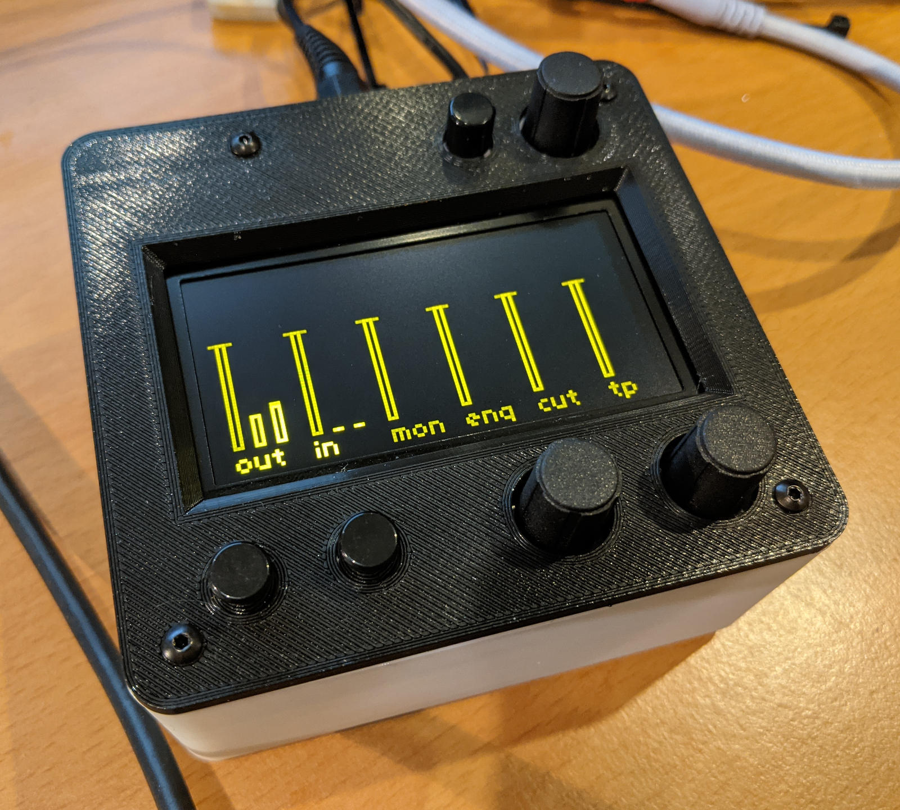
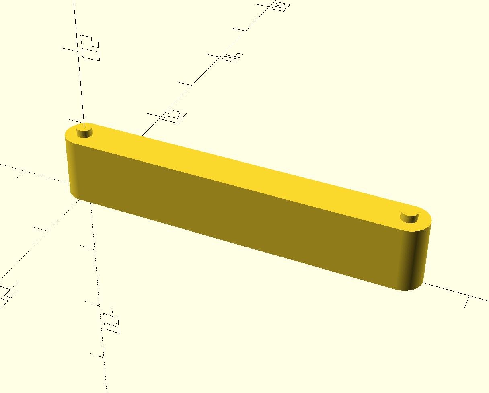
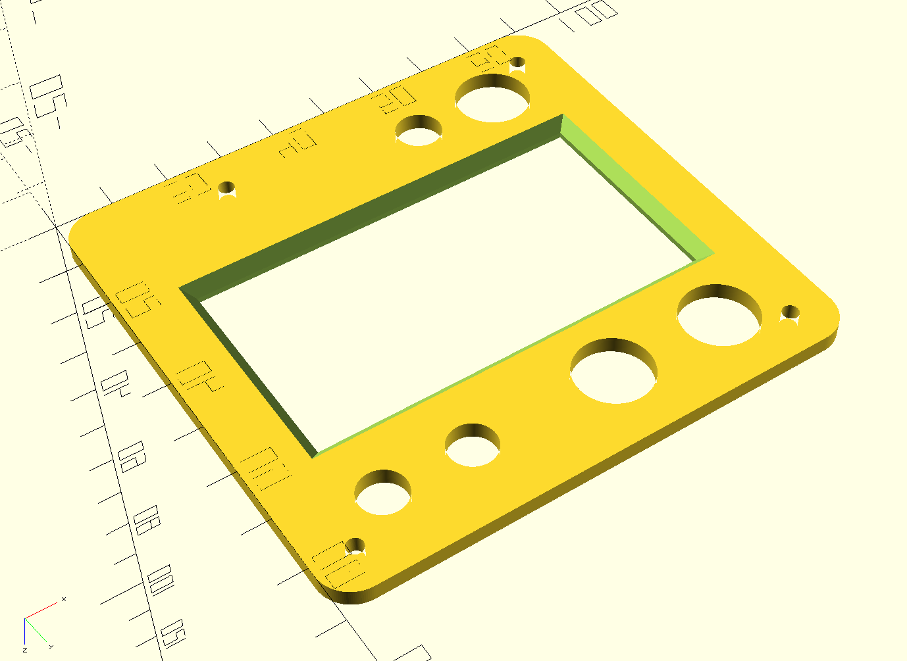
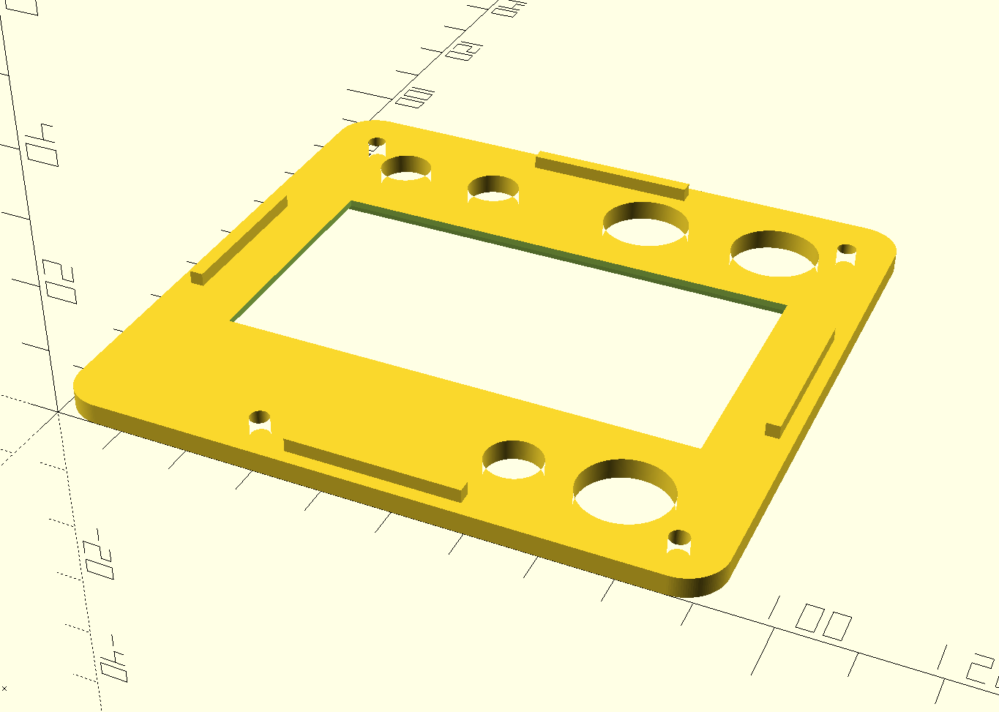

# Norns shield case extras

[What is a Norns shield?](https://github.com/monome/norns-shield)

## Metric-friendly base

This is rebuilt from scratch to the same dimensions as [JHC's original
design](https://llllllll.co/t/norns-shield-case-designs/30347/224) with a few
changes.

Rather than the US standoffs and spacers that are hard to find in Europe, this
is designed to use metric hardware:

- 4 × M2.5 12mm long male-female standoffs
- 2 × M2.5 16mm long female standoffs
- 2 × M2.5 20mm long female standoffs
- 8 × M2.5 10mm button-head screw

For printing, a 0.2mm layer height is recommended. You can speed up the print
by printing solid vertical walls (set wall line count to a higher value than
usual).

## Screen support

These help to keep the screen horizontal and in place. They can be attached
between the screen and shield PCBs using a small piece of double-sided tape on
each side.

## Top plate

The thickness and dimensions of the knobs and buttons can be adjusted via the
appropriate variables.

The plate is intended to be printed upside down, so that the final upper
surface is on the print bed. On my printer, this gives a pleasing finish from
the textured bed.

The four blocks on the underside help to locate the plate and prevent the case
from flexing inwards.

This can be printed thicker (say 3.2mm) to be used as a top on its own without
the acrylic sheet.
